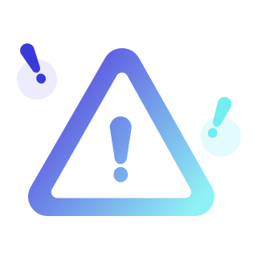

# SVG Icon List

This folder contains the following SVG icon files with previews:

### CalendarCheck.svg

### UploadSimple-1.svg

### UploadSimple.svg

### UserCircleCheck.svg

### UserCircleGear.svg

### UserCirclePlus.svg

### alarm_36.svg

### and_ic_dissmiss_28.svg

### btn_search_60.svg

### ekec.svg

### google.svg

### ic_CalendarCheck_36.svg

### ic_ChatText_40.svg

### ic_Crown_36.svg

### ic_Dot_36.svg

### ic_Down_24.svg

### ic_Down_28.svg

### ic_Down_36.svg

### ic_Left_24.svg

### ic_Left_28.svg

### ic_Right_24.svg

### ic_Right_28.svg

### ic_Right_wh_28.svg

### ic_Star_36.svg

### ic_Up_24.svg

### ic_Up_28.svg

### ic_Up_36.svg

### ic_UserCircleCheck_36.svg

### ic_UserCircleGear_36.svg

### ic_UserCirclePlus_36.svg

### ic_UserCircle_ white_36.svg

### ic_UserCircle_36.svg

### ic_add_36.svg

### ic_alarm_36.svg

### ic_alarm_40.svg

### ic_alarm_48.svg

### ic_alarm_new_40.svg

### ic_alarm_new_48.svg

### ic_black_ImageSquare_36.svg

### ic_category_36.svg

### ic_category_white_36.svg

### ic_check_Deact.svg

### ic_check_de.svg

### ic_check_pressed.svg

### ic_circleplus_ arrow.svg

### ic_dissmiss_20.svg

### ic_dissmiss_24.svg

### ic_dissmiss_28.svg

### ic_error_20.svg

### ic_eye_24.svg

### ic_eyeoff_24.svg

### ic_gra_ImageSquare_36.svg

### ic_heart_40.svg

### ic_line_ arrow.svg

### ic_line_Camera.svg

### ic_line_logout_black.svg

### ic_line_logout_co.svg

### ic_line_user.svg

### ic_line_user_black.svg

### ic_line_user_co.svg

### ic_listsearch_36.svg

### ic_listsearch_white_36.svg

### ic_man_28.svg

### ic_minus_ arrow.svg

### ic_plus_ arrow.svg

### ic_radio_Deact.svg

### ic_radio_de.svg

### ic_radio_pressed.svg

### ic_reset_20.svg

### ic_reset_28.svg

### ic_search_36.svg

### ic_share_40.svg

### ic_success_20.svg

### ic_trash_ arrow.svg

### ic_woman_28.svg

### img_graphic_320.svg

### kakaotalk.svg

### naver.svg

